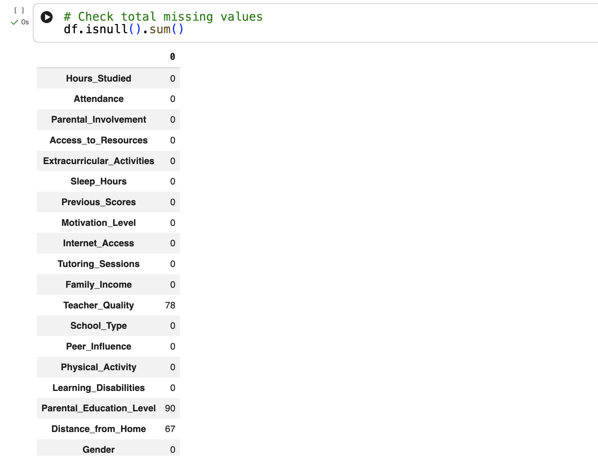
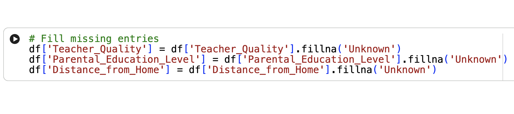
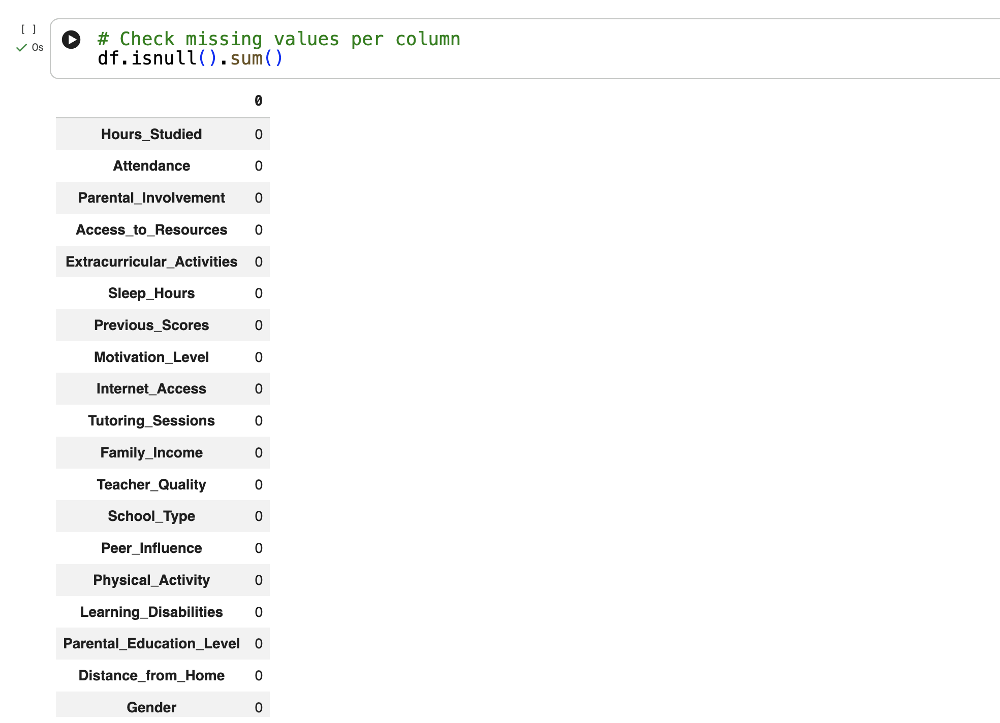
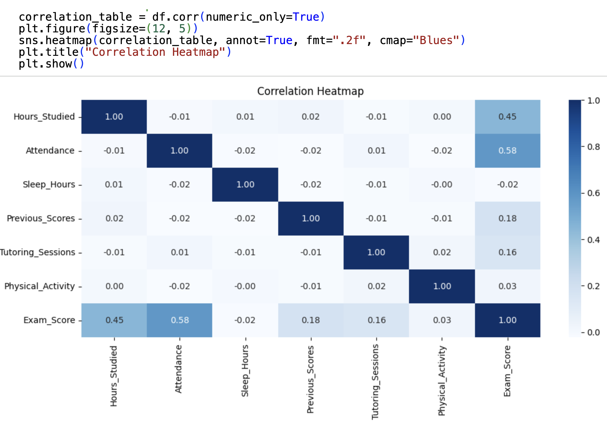
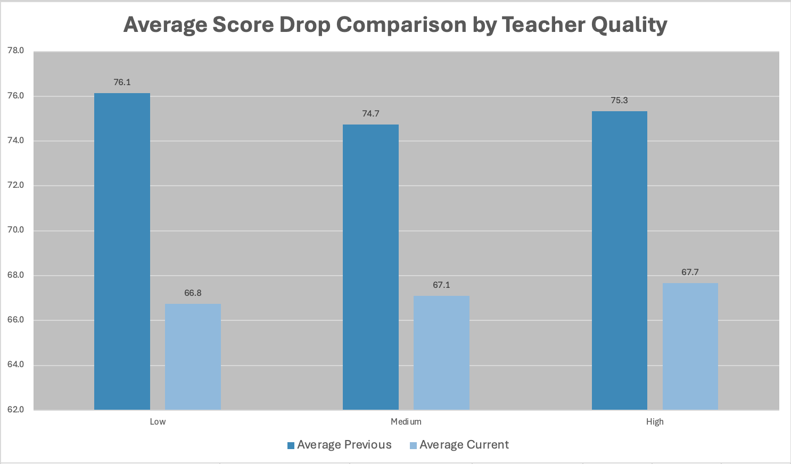
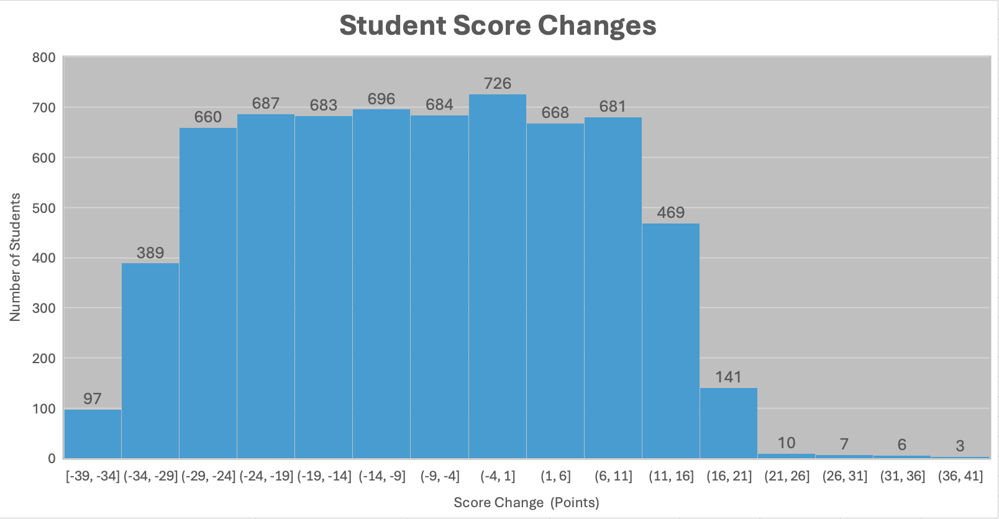
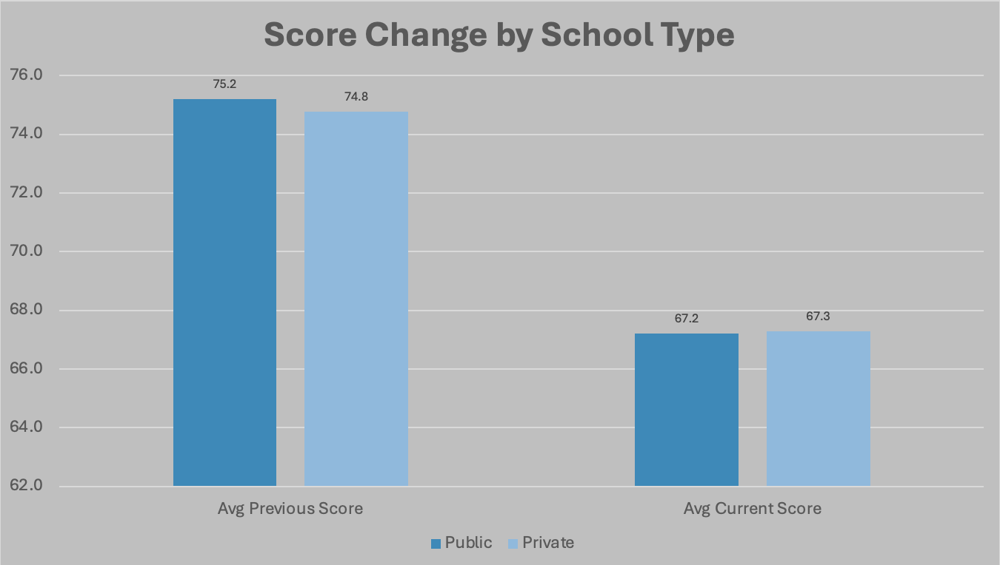
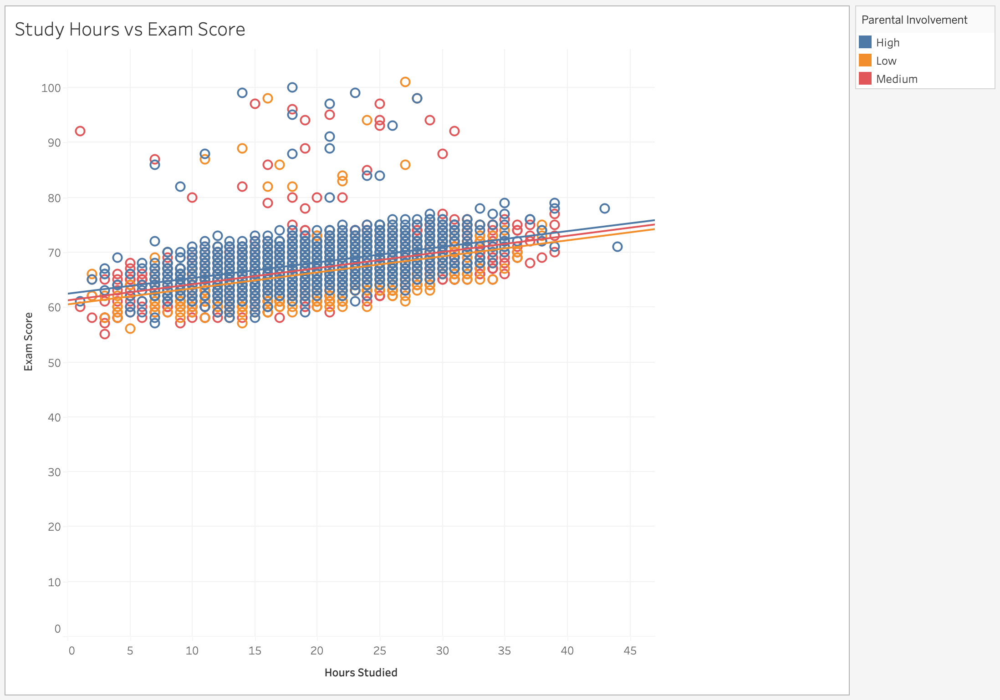
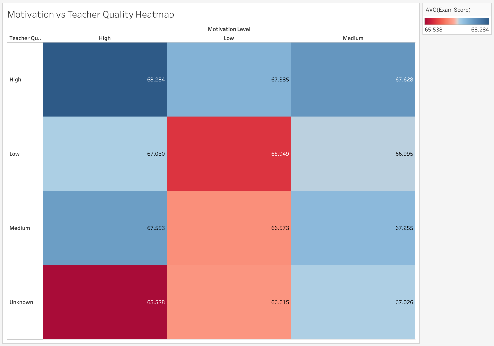

# Student Performance Factors Analysis 📊

## Overview

This project explores factors that influence student academic performance using Python, Excel and Tableau.

The project followed a complete data analysis workflow, beginning with data cleaning in Python, followed by statistical analysis in Excel, and ending with data visualisation in Tableau to identify trends and patterns within the dataset.

---

## Project Objectives

- Clean and prepare data for analysis
- Investigate factors that may impact student performance
- Compare exam score changes across different groups
- Create visualisations to communicate findings effectively
- Develop practical skills in Python, Excel and Tableau

---

## Technologies Used

- Python
- Pandas
- Excel
- Tableau
- GitHub

---

## Project Workflow

### 1. Data Cleaning and Preparation (Python)

The dataset was imported into Python using Pandas and checked for missing values.

Missing values in the following columns were identified and replaced with **"Unknown"**:

- Teacher Quality
- Parental Education Level
- Distance from Home

The cleaned dataset was then exported as a new CSV file for further analysis in Excel.

#### Python Data Cleaning





A correlation heatmap was also created using Seaborn to explore relationships between numerical variables.

#### Correlation Heatmap



### Skills Demonstrated

- Data Importing
- Data Cleaning
- Missing Value Handling
- Data Exporting
- Correlation Analysis
- Python Programming
- Pandas
- Seaborn

---

### 2. Data Analysis (Excel)

The cleaned dataset was imported into Excel for analysis.

#### Student Overview

- Total Students: 6,607
- Private School Students: 2,009
- Public School Students: 4,598

#### Previous vs Current Scores

| Metric | Previous Scores | Current Scores | Difference/Growth |
|----------|----------|----------|----------|
| Average Score | 75.1 | 67.2 | -7.8 |
| Median Score | 75 | 67 | -8 |
| Max Score | 100 | 100 | 0 |
| Min Score | 50 | 55 | +5 |

This analysis showed an average score decrease of **7.8 points**.

---

### Teacher Quality Analysis

Average scores were analysed based on teacher quality.

#### Average Score Drop Comparison by Teacher Quality



| Teacher Quality | Average Previous Score | Average Current Score |
|----------|----------|----------|
| Low | 76.1 | 66.8 |
| Medium | 74.7 | 67.1 |
| High | 75.3 | 67.7 |

A clustered bar chart was created to compare average score changes across teacher quality levels.

---

### Student Improvement Analysis

A new column called **Score Improvement** was created by calculating:

```excel
Current Score - Previous Score
```

Key findings:

- Average Student Improvement: -7.8
- Students Who Improved: 2,140
- Percentage Who Improved: 32%

A histogram was created to visualise the distribution of score changes.

#### Student Score Changes Histogram



---

### School Type Analysis

Student performance was compared between public and private schools.

| School Type | Avg Previous Score | Avg Current Score | Average Change |
|----------|----------|----------|----------|
| Public | 75.2 | 67.2 | -8.0 |
| Private | 74.8 | 67.3 | -7.5 |

A bar chart was created to compare score changes by school type.

#### Score Change by School Type



### Skills Demonstrated

- Excel Functions
- COUNTA
- COUNTIF
- Data Analysis
- Statistical Analysis
- Data Visualisation
- Chart Creation
- Data Interpretation

---

### 3. Data Visualisation (Tableau)

Tableau was used to create interactive visualisations and explore relationships within the dataset.

#### Hours Studied vs Exam Score

A scatter plot was created to investigate the relationship between study hours and exam performance while factoring in parental involvement.



#### Motivation Level vs Teacher Quality

A heatmap was created to analyse the relationship between student motivation levels and teacher quality.



### Skills Demonstrated

- Tableau
- Dashboard Design
- Interactive Visualisations
- Data Storytelling
- Trend Analysis
- Insight Generation

---

## Key Insights

- Student exam scores decreased by an average of 7.8 points compared to previous scores.
- Private school students experienced a slightly smaller score decline than public school students.
- Higher teacher quality was associated with higher average current exam scores.
- Only 32% of students improved their scores.
- Study habits, parental involvement and teacher quality appear to influence academic performance.

---

## Skills Demonstrated

- Python
- Pandas
- Excel
- Tableau
- Data Cleaning
- Data Analysis
- Data Visualisation
- Statistical Analysis
- Problem Solving
- GitHub Documentation

---

## Future Improvements

- Create an interactive Tableau dashboard combining all visualisations.
- Perform additional statistical analysis to investigate relationships between variables.
- Explore predictive modelling techniques using Python.
- Build a Power BI dashboard for comparison with Tableau.

---
